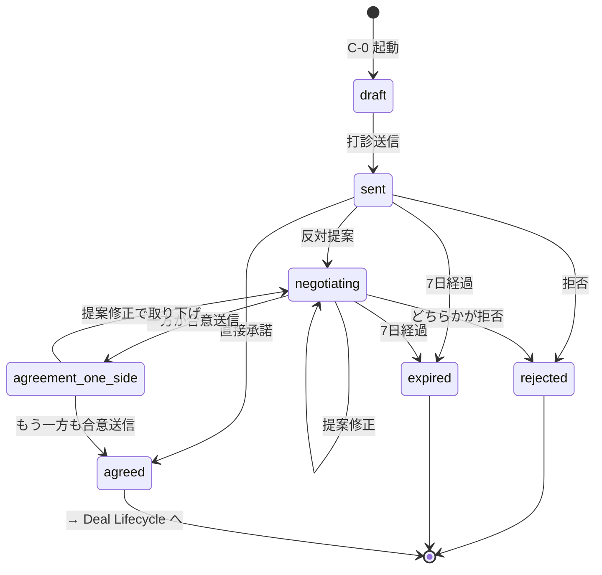
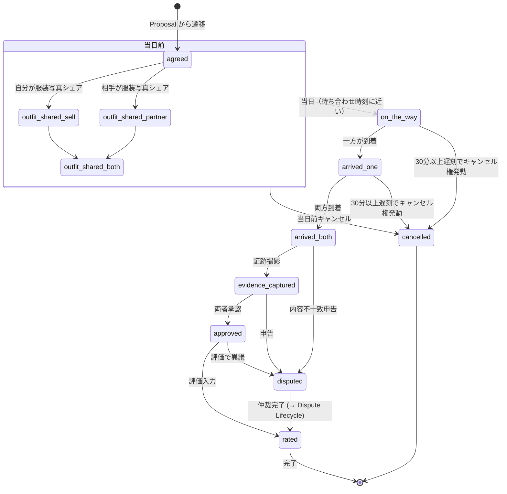
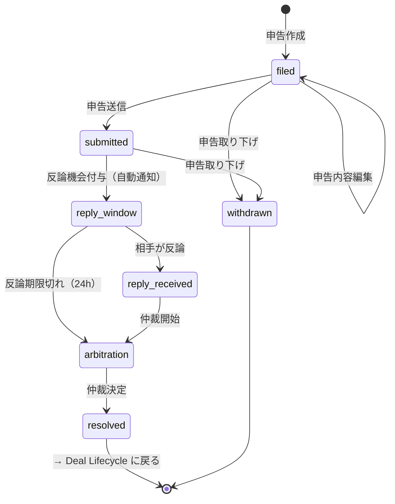
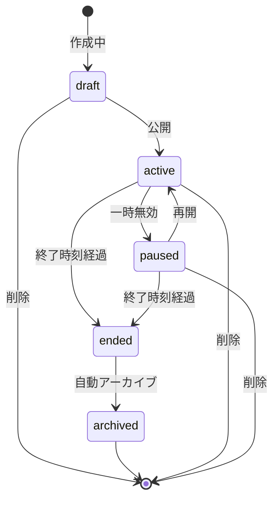
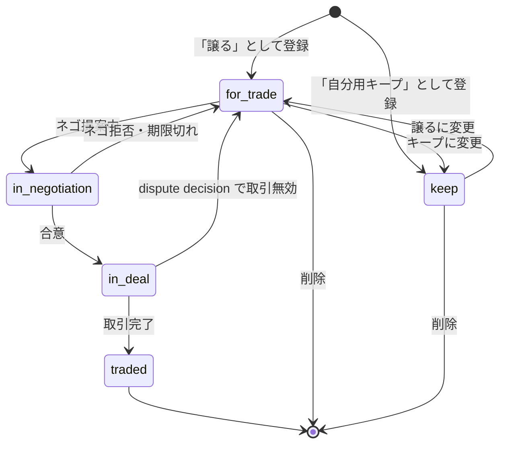
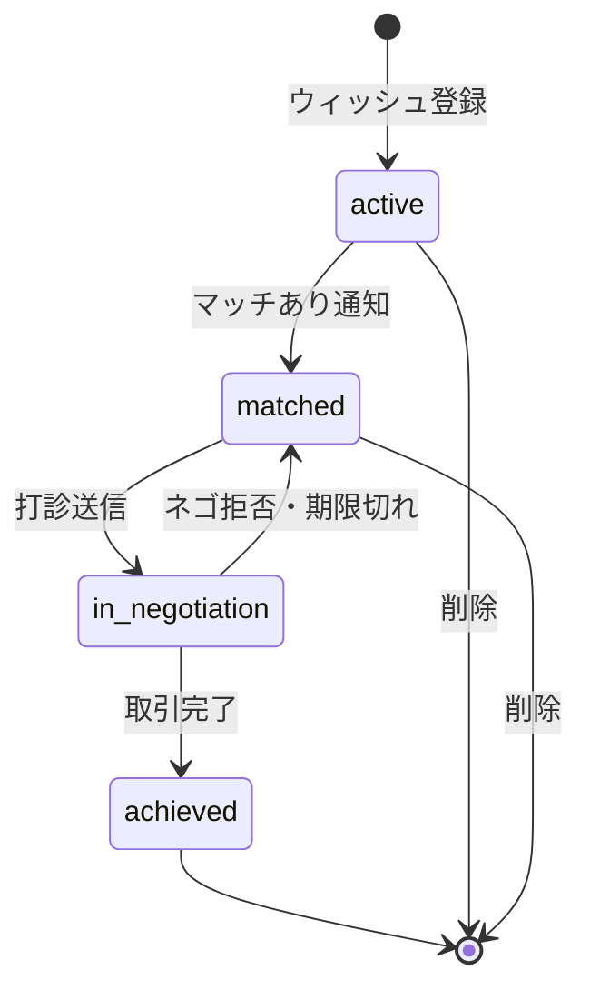
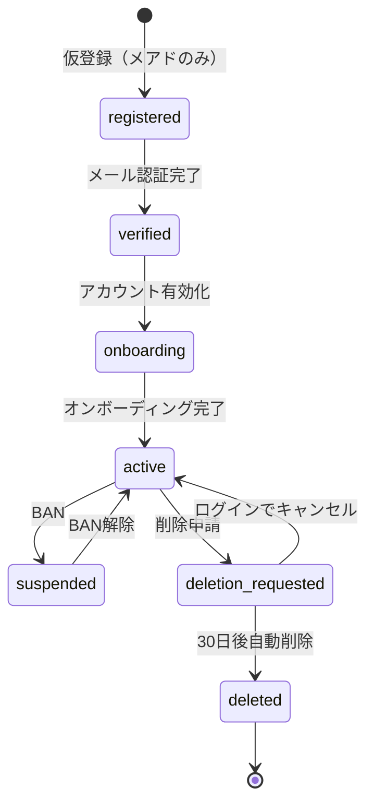
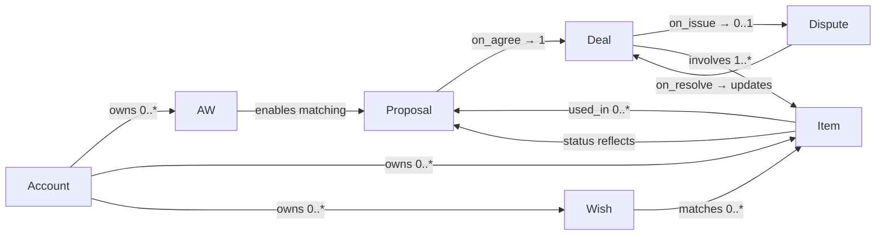

# 09. 状態遷移図（State Machines）

> **目的**：iHub の主要エンティティのライフサイクルと状態遷移ルールを定義。
> 実装が状態遷移でブレないための一次資料。デザイン・実装・QA の共通言語。

最終更新: 2026-05-01
ステータス: Draft v1.0

---

## このドキュメントの使い方

- **記法**: mermaid（GitHub / VS Code / Mermaid Live でレンダリング可）
- **状態識別子**: `snake_case`（実装でも同じ識別子を使う）
- **トリガー**: `from → to` の遷移を起こすユーザー操作 or システムイベント
- **ビジネスルール**: 状態遷移に紐づく時間・SLA・前提条件

## 更新ルール

1. デザイン or 仕様変更で**状態の追加・削除・名称変更**があった場合、必ず該当箇所を更新する
2. 状態識別子は実装と完全一致させる（`agreed` を `agreement_complete` に勝手に変えない）
3. mermaid記法のエラーが出たら、Mermaid Live ([https://mermaid.live](https://mermaid.live)) で確認
4. 各セクション末尾の「関連画面」と「関連ファイル」を必ず併記し、cross-reference を保つ

## 目次

1. [Proposal Lifecycle（打診〜合意）](#1-proposal-lifecycle)
2. [Deal Lifecycle（合意〜完了）](#2-deal-lifecycle)
3. [Dispute Lifecycle（異議申し立て）](#3-dispute-lifecycle)
4. [AW Lifecycle（活動予定）](#4-aw-lifecycle)
5. [Item Lifecycle（在庫アイテム）](#5-item-lifecycle)
6. [Wish Lifecycle](#6-wish-lifecycle)
7. [Account Lifecycle](#7-account-lifecycle)
8. [付録：エンティティ間の関係](#8-付録エンティティ間の関係)

---

## 1. Proposal Lifecycle

打診（提案）の作成から、合意成立または terminal state まで。
合意成立（`agreed`）後は **Deal Lifecycle** に引き継がれる。

### 状態図

### 状態定義

| 状態 ID | 表示名 | 意味 | 主画面 |
|---|---|---|---|
| `draft` | 下書き | C-0 で編集中（DBには未登録 or `status=draft`） | C-0 |
| `sent` | 送信済 | 受諾者の判断待ち | C-1 受信側 |
| `negotiating` | ネゴ中 | 提案修正のやりとり中 | C-1.5 |
| `agreement_one_side` | 一方合意済 | 一方が合意送信、他方待ち | C-1.5（mine-agreed scenario） |
| `agreed` | 合意済 | 双方合意・取引成立 | → Deal Lifecycle |
| `rejected` | 拒否済 | terminal | — |
| `expired` | 期限切れ | terminal、再打診で新規作成 | C-1.5（expired scenario） |

### 主要トリガー

| from → to | トリガー | 主体 | 画面 |
|---|---|---|---|
| `[*] → draft` | C-0 起動（マッチカードから「打診する」） | 提案者 | ホーム → C-0 |
| `draft → sent` | 「打診を送る」CTA | 提案者 | C-0 |
| `sent → agreed` | 「承諾する」 | 受諾者 | C-1 受信 |
| `sent → rejected` | 「拒否する」 | 受諾者 | C-1 受信 |
| `sent → negotiating` | 「反対提案する」 | 受諾者 | C-1 受信 |
| `negotiating → agreement_one_side` | 「合意して受諾」→確認モーダルOK | どちらか | C-1.5 |
| `agreement_one_side → agreed` | 残った片方も「合意して受諾」 | 残った人 | C-1.5 |
| `* → expired` | 最終アクションから 7日経過 | システム | バックグラウンド |

### ビジネスルール

- **期限**: 各「最新提案バージョン」から 7日経過で `expired`
- **延長**: `negotiating` ステートでのみ「+7日延長」可能、何回でも（iter30）
- **リマインド**: 3日目（lavender系バナー）と 6日目（warn系バナー）に通知＋画面内バナー
- **提案修正**: `negotiating` 中の提案修正でも 7日カウントは**継続**（リセットしない）　※要確認
- **再開**: `expired` から再度打診したい場合は新規 `draft` 作成
- **24時間無応答での自動拒否は廃止**（旧仕様、iter30）

### 関連画面

- C-0 提示物選択（draft 編集）
- C-1 打診送信／受信
- C-1.5 ネゴチャット（normal / reminder3 / reminder6 / expired / mine-agreed）
- 合意確認モーダル（agreement_one_side 直前）
- 取引成立画面（agreed 直後）

### 関連ファイル

- `iHub/propose-select.jsx`
- `iHub/c-flow.jsx`（C-1）
- `iHub/nego-flow.jsx`（C-1.5、合意確認、成立画面）

---

## 2. Deal Lifecycle

合意成立した取引の、当日〜完了まで。
入口は Proposal Lifecycle の `agreed`、出口は `rated`（完了）または `cancelled`、または `disputed`（→ Dispute Lifecycle）。

### 状態図

### 状態定義

| 状態 ID | 表示名 | 意味 |
|---|---|---|
| `agreed` | 合意済 | 取引成立、当日待ち |
| `outfit_shared_self` | 自分のみ服装写真済 | 部分状態 |
| `outfit_shared_partner` | 相手のみ服装写真済 | 部分状態 |
| `outfit_shared_both` | 両者服装写真済 | 部分状態 |
| `on_the_way` | 移動中 | 当日に現在地共有開始 |
| `arrived_one` | 一方到着 | 片方が会場到着 |
| `arrived_both` | 両者到着 | 合流可能 |
| `evidence_captured` | 証跡撮影済 | 両者の品物を1枚に撮影 |
| `approved` | 両者承認済 | 内容OK |
| `rated` | 評価済 | terminal（完了） |
| `disputed` | dispute中 | → Dispute Lifecycle |
| `cancelled` | キャンセル済 | terminal |

### ビジネスルール

- **服装写真共有**: 任意だが推奨。C-2 で目立つCTA（iter34）
- **現在地共有**: 任意だが当日推奨（iter34）
- **遅刻SLA**: 待ち合わせ時刻から30分超過で相手側にキャンセル権発動（iter20）
- **本人確認**: QRコード相互スキャン（C-2 ヘッダーから）
- **証跡撮影レイアウト**: 「左=相手 / 右=自分」固定（確定設計）
- **両者承認**: 双方ともOKで `approved`、片方NGで `disputed`
- **評価**: 1-5 stars＋コメント、片方が先でもOK、両者完了で `rated`

### 関連画面

- C-2 取引チャット（agreed〜arrived_both）
- C-3 証跡撮影（evidence_captured 直前）
- C-3 両者承認（approved 直前）
- C-3 評価（rated 直前）

### 関連ファイル

- `iHub/c-flow.jsx`（C-2 ChatScreen, C-3 CompleteScreen）

---

## 3. Dispute Lifecycle

取引異常時の異議申し立てフロー（D-flow）。

### 状態図

### 状態定義

| 状態 ID | 表示名 | 意味 |
|---|---|---|
| `filed` | 申告作成中 | 下書き |
| `submitted` | 申告送信済 | 反論待ち |
| `reply_window` | 反論機会期間 | 24h or 4h |
| `reply_received` | 反論受領 | 仲裁前 |
| `arbitration` | 仲裁中 | 運営対応 |
| `resolved` | 仲裁決定済 | → Deal Lifecycle |
| `withdrawn` | 申告取り下げ | terminal |

### ビジネスルール

- **5種カテゴリ**: ドタキャン／遅刻／不一致／破損／その他（iter12）
- **仲裁SLA**: 当日4h、それ以外24h（iter13）
- **凍結**: 申告中は両者とも新規打診不可（iter14、共に新規のみ）
- **反論機会付与**: submit と同時に相手に通知（iter15）
- **受付番号**: 採番（iter16）
- **24h残時間カウンタ**: 表示（iter17）
- **書き方のコツ**: filing 時にアドバイス表示（iter18）

### 関連画面

- D-flow（10画面、c-dispute.jsx）

### 関連ファイル

- `iHub/c-dispute.jsx`
- `iHub/iHub Dispute Flow _standalone_.html`

---

## 4. AW Lifecycle

Activity Window = 「私はこの時間ここにいる」予定。場所＋時間枠。

### 状態図

### 状態定義

| 状態 ID | 表示名 | 意味 |
|---|---|---|
| `draft` | 下書き | 編集中 |
| `active` | アクティブ | 公開中（マッチング対象） |
| `paused` | 一時無効 | マッチング対象外 |
| `ended` | 終了 | 時間経過後 |
| `archived` | アーカイブ済 | 自動アーカイブされた |

### ビジネスルール

- **AW自動登録**: C-0 で「日時指定」＋「AW自動登録」チェックでカスタム日時から作成（iter33）
- **マッチング**: 双方の `active` AW が時間・場所で重なるとマッチ候補
- **一時無効**: 急用などで使えない時にpause、復活は resume（iter15 系の AW 仕様）
- **アーカイブ**: 終了から 24h（？要確認）で自動アーカイブ
- **編集案①／②**: 事前計画／当日現地 両方の編集経路を維持（確定設計）

### 関連画面

- AW 編集画面
- C-0 待ち合わせタブ（日時指定モードでAW候補リスト表示）

### 関連ファイル

- `iHub/aw-edit.jsx`
- `iHub/propose-select.jsx`（meetup タブ）

---

## 5. Item Lifecycle

在庫アイテム（譲・自分用キープ）のライフサイクル。

### 状態図

### 状態定義

| 状態 ID | 表示名 | 意味 |
|---|---|---|
| `for_trade` | 譲る候補 | 公開中・打診対象 |
| `keep` | 自分用キープ | 譲らず保持 |
| `in_negotiation` | 提案中 | 1件以上のネゴで使用中 |
| `in_deal` | 取引中 | 合意済 deal で確保 |
| `traded` | 譲り済 | 過去ログ |

### ビジネスルール

- **複数提案OK**: 同じアイテムが複数のネゴで `in_negotiation` 同時可能
- **合意で確定**: `in_deal` になると他のネゴで自動的に「使用不可」表示
- **traded 表示**: B-1 の「過去に譲った」サブビューで参照（iter19.5）
- **数量管理**: アイテムは `qty` を持ち、提案ごとに `selectedQty` を割り当てる（iter29）

### 関連画面

- B-1 在庫一覧
- B-2 撮影フロー
- C-0 提示物選択（譲側）

### 関連ファイル

- `iHub/b-inventory.jsx`
- `iHub/propose-select.jsx`

---

## 6. Wish Lifecycle

求めているグッズの管理。

### 状態図

### 状態定義

| 状態 ID | 表示名 | 意味 |
|---|---|---|
| `active` | 探し中 | 検索対象 |
| `matched` | マッチあり | 候補あり通知済 |
| `in_negotiation` | 打診中 | ネゴ中 |
| `achieved` | 達成 | 取引完了で入手済 |

### ビジネスルール

- **flexibility / priority カラム**: ウィッシュは「絶対欲しい／妥協可」の柔軟度と優先度を持つ（既存スキーマ）
- **コレクション表示**: wish ベースで影絵→入手済の図鑑（iter19.7-9）
- **コンプリート目標は否定**: 「全種コンプ」を強制しない設計（ユーザー判断）

### 関連画面

- ウィッシュタブ（hub-screens.jsx）
- コレクション図鑑（4画面）

### 関連ファイル

- `iHub/hub-screens.jsx`

---

## 7. Account Lifecycle

ユーザーアカウントのライフサイクル。

### 状態図

### 状態定義

| 状態 ID | 表示名 | 意味 |
|---|---|---|
| `registered` | 仮登録 | メール認証前 |
| `verified` | 認証済 | メール認証完了 |
| `onboarding` | オンボ中 | 性別→推し→メンバー→AW→完了 |
| `active` | アクティブ | 通常アカウント |
| `suspended` | 停止中 | BAN 状態 |
| `deletion_requested` | 削除申請中 | 30日猶予期間 |
| `deleted` | 削除済 | terminal |

### ビジネスルール

- **OAuth経路（Google等）**: メール認証 skip → `verified` に直行（iter20）
- **削除30日猶予**: その間にログインで `active` に復帰可能
- **オンボーディング段階**: 性別→推しグループ→メンバー→AWエリア→完了（iter20）

### 関連画面

- 認証 13画面（auth-onboarding.jsx）

### 関連ファイル

- `iHub/auth-onboarding.jsx`

---

## 8. 付録：エンティティ間の関係

### 関係性メモ

- **1 Proposal = 1 Deal**: 合意成立時点で Proposal は確定、以降は Deal のライフサイクル
- **1 Deal = 0..1 Dispute**: 1つの取引につき申告は最大1件（重複申告は不可）
- **1 Item は複数 Proposal で `in_negotiation`** だが、`in_deal` になれるのは1つだけ
- **1 Account は複数 AW を持てる**（過去・未来含めて）

---

## 未確定・要確認項目

実装着手前にユーザーと擦り合わせる項目。`05_data_model.md` の末尾「⚠️ 未確定項目」とも連携。

### 状態遷移ルール関連

| # | 項目 | 状況 |
|---|---|---|
| 1 | ネゴ中の提案修正で 7日カウントはリセットされるか？ | **要確認**（現状は継続前提で記述） |
| 2 | AW の `ended` から `archived` への自動遷移時間（24h？） | **要確認** |
| 3 | dispute の反論機会期間が 24h or 4h はカテゴリで変わるか？ | **要確認** |
| 4 | アカウント削除30日猶予の起点は申請時刻 or 日付ベース？ | **要確認** |
| 5 | Wish の `matched` 状態は1回通知するだけか、継続的に？ | **要確認** |
| 6 | Proposal の `cancelled` 状態を追加するか（送信前取消・送信後 sender 取消等）？ | **要確認**（iter38で追加検討） |
| 7 | `agreement_one_side` 中の提案修正で `agreed_by_*` を reset するか？ | **要確認**（iter38で追加検討） |
| 8 | `disputed` 解決時に `rated` に戻るか別の終了状態（例：`disputed_resolved`）か？ | **要確認**（iter38で追加検討） |
| 9 | Item の `kind=keep` は `status=in_negotiation` に遷移しうるか？（自分用なら他人に出さない） | **要確認**（iter38で追加検討） |
| 10 | Item の `traded` 後に `kind` を保持か reset か？ | **要確認**（iter38で追加検討） |
| 11 | `auto_from_proposal` で作られた AW は、対応する deal が cancel/dispute になった時に削除？保持？ | **要確認**（iter38で追加検討） |

### 検知・トリガー関連

| # | 項目 | 状況 |
|---|---|---|
| 12 | 到着検知の仕組み（手動報告 / GPS自動 / QRスキャン時自動 / 全部？） | **要確認**（iter38で追加検討） |
| 13 | マッチング計算のバッチ頻度（毎日 / 6h / 1h） | **要確認**（iter38で追加検討） |
| 14 | リアルタイム通知のスロットル（同じユーザー間で1日N回まで等） | **要確認**（iter38で追加検討） |

### データ構造関連

| # | 項目 | 状況 |
|---|---|---|
| 15 | `meetup_scheduled_custom` を proposals の JSONB カラムか、別テーブル `proposal_meetups` か | **要確認**（iter38で追加検討） |
| 16 | `outfit_photo` を `messages.message_type='outfit_photo'` か、専用テーブル `deal_outfit_photos` か | **要確認**（iter38で追加検討） |
| 17 | `proposal_revisions` の履歴保存粒度（毎修正全部 vs 直近N件） | **要確認**（iter38で追加検討） |
| 18 | system message の `event_type` 値リスト確定（'arrival', 'agreement_one_side' 等） | **要確認**（iter38で追加検討） |

これらは実装着手前にユーザーと擦り合わせる項目。詳細は `05_data_model.md` の「⚠️ 未確定項目」表を参照。
