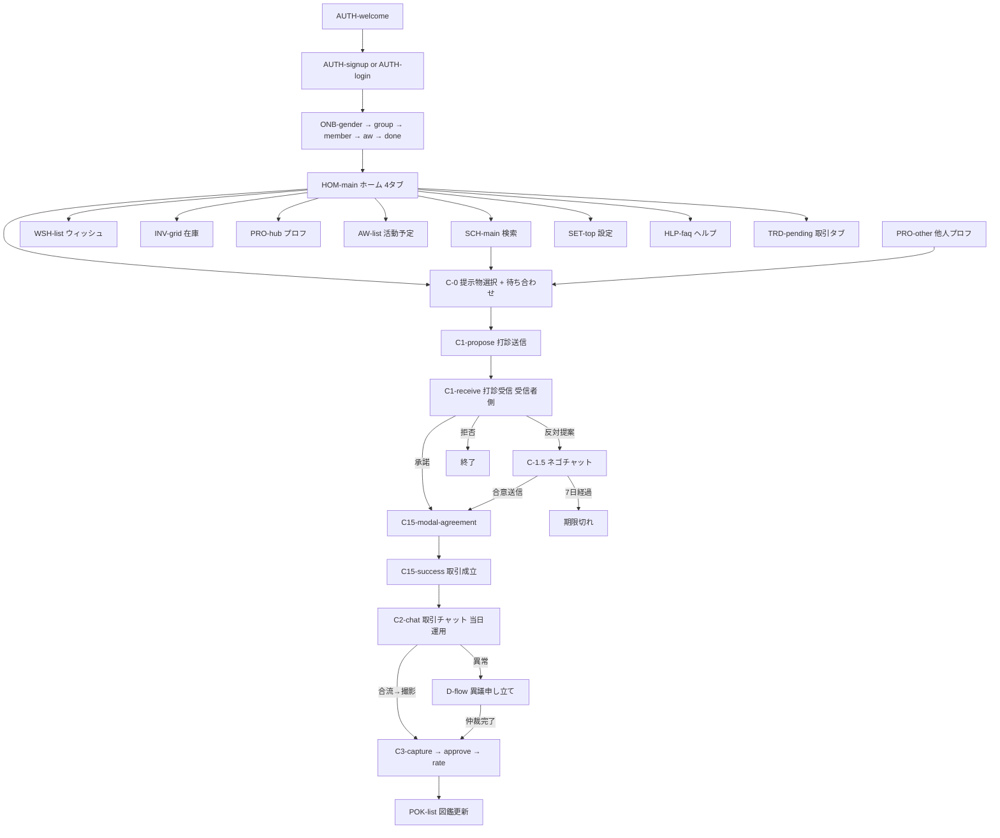
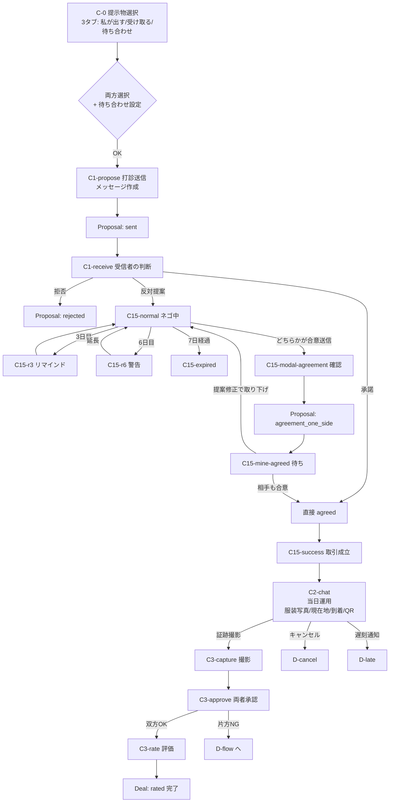
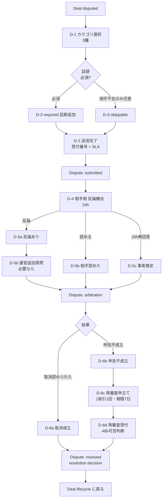
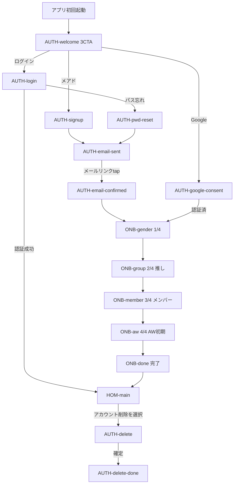

# 11. 画面インベントリ（Screen Inventory）

> **目的**：iHub の全画面を一覧化し、画面 ID・所属フロー・関連 JSX・関連 iter・関連 docs をクロスリファレンス。
> 実装着手時の「どの画面を作る？」「どの画面の仕様はどこ？」を一発で引けるようにする。

最終更新: 2026-05-01
ステータス: Draft v1.0（iter40）

---

## このドキュメントの使い方

- **画面ID**：実装で使う識別子。`PREFIX-name` の形式（例: `C0-mine-perfect`）
- **所属フロー**：そのHTMLファイル / 主要動線のグルーピング
- **関連JSX**：実装の本体ファイル
- **関連iter**：直近の主要更新 iter（複数あり得る）
- **関連 docs**：このドキュメントから引きたい先（09 / 10 / 12_screens 等）

## 更新ルール

- 新規画面追加時、必ずこのインベントリにも追加
- 画面ID は **実装でも同じ識別子**を使う（命名で揺れない）
- 廃止画面は削除せず `J. 廃止画面` セクションへ移動

---

## 目次

- [全画面サマリ](#全画面サマリ)
- [A. 認証・オンボーディング](#a-認証オンボーディング)
- [B. 主要フロー（取引体験）](#b-主要フロー取引体験)
- [C. ハブ画面（日常使い）](#c-ハブ画面日常使い)
- [D. サポート・設定](#d-サポート設定)
- [E. 図鑑・特殊](#e-図鑑特殊)
- [F. メイン動線フロー図（mermaid）](#f-メイン動線フロー図mermaid)
- [G. 取引フロー詳細図](#g-取引フロー詳細図)
- [H. Dispute フロー詳細図](#h-dispute-フロー詳細図)
- [I. 認証・オンボフロー図](#i-認証オンボフロー図)
- [J. 廃止画面](#j-廃止画面)

---

## 全画面サマリ

| カテゴリ | 画面数 | 代表 iter |
|---|---|---|
| A. 認証・オンボーディング | 13 | iter20 |
| B. 主要フロー（C-0〜C-3 + D-flow） | 35 | iter27-34, iter12-18 |
| C. ハブ画面（ホーム・プロフ・ウィッシュ・在庫・検索・AW） | 22 | iter19.5, 22-26 |
| D. サポート・設定 | 14 | iter21-22 |
| E. 図鑑・特殊 | 5 | iter19.7-9 |
| **合計（最新版）** | **89** | — |
| J. 廃止画面（参考のみ） | 〜10 | — |

---

## A. 認証・オンボーディング

ファイル：`iHub/auth-onboarding.jsx`、表示HTML：`iHub Auth Onboarding.html`

### 認証フロー（A-1）

| 画面ID | 名称 | 関連JSX関数 | 関連iter | 関連docs |
|---|---|---|---|---|
| `AUTH-welcome` | ウェルカム — メアド・Google・ログインの3CTA | `auth-onboarding.jsx::WelcomeScreen` | iter20 | 09 §7 |
| `AUTH-signup` | 新規登録（メアド）— ハンドル＋メアド＋パスワード＋同意一体型 | `auth-onboarding.jsx::SignUpScreen` | iter20 | 09 §7, 05 §2 users |
| `AUTH-google-consent` | Google経由同意 — メール認証スキップ・ハンドル＋規約のみ | `auth-onboarding.jsx::GoogleConsentScreen` | iter20 | 09 §7 |
| `AUTH-email-sent` | メール認証送信 — 60秒再送ガード・迷惑メール案内 | `auth-onboarding.jsx::EmailSentScreen` | iter20 | 09 §7 |
| `AUTH-email-confirmed` | メール認証完了 — 大きな ✓ アイコン＋次へ誘導 | `auth-onboarding.jsx::EmailConfirmedScreen` | iter20 | 09 §7 |
| `AUTH-login` | ログイン — メアド＋パス／Google並列・パスワード忘れリンク | `auth-onboarding.jsx::LoginScreen` | iter20 | 09 §7 |
| `AUTH-pwd-reset` | パスワードリセット — メアド入力＋送信 | `auth-onboarding.jsx::PasswordResetScreen` | iter20 | — |
| `AUTH-delete` | アカウント削除 — 警告＋理由選択（任意・複数） | `auth-onboarding.jsx::AccountDeleteScreen` | iter20 | 09 §7 |
| `AUTH-delete-done` | アカウント削除完了 — 削除データ一覧＋再登録CTA | `account-extras.jsx::DeleteDoneScreen` | iter22 | 09 §7 |

### オンボーディング（A-2）

| 画面ID | 名称 | 関連JSX関数 | 関連iter | 関連docs |
|---|---|---|---|---|
| `ONB-gender` | 性別選択（1/4）— マッチング安全性のため必須 | `auth-onboarding.jsx::OnboardGenderScreen` | iter20 | 05 §2 users.gender |
| `ONB-group` | 推し選択（2/4）— ジャンル横断＋人気バッジ＋検索 | `auth-onboarding.jsx::OnboardGroupScreen` | iter20, iter24 | 05 §1 groups_master |
| `ONB-member` | 推しキャラ・推しメン選択（3/4）— DD対応・箱推しショートカット | `auth-onboarding.jsx::OnboardMemberScreen` | iter20, iter24 | 05 §1 characters_master, 05 §2 user_oshi |
| `ONB-aw` | AW初期設定（4/4）— エリア選択（任意・スキップ可） | `auth-onboarding.jsx::OnboardAWScreen` | iter20 | 05 §4 aws |
| `ONB-done` | 完了 — プロフサマリ＋次は何をする？3カード | `auth-onboarding.jsx::OnboardDoneScreen` | iter20 | — |

---

## B. 主要フロー（取引体験）

### B-1. C-0 提示物選択（propose-select.jsx）

ファイル：`iHub/propose-select.jsx`、表示HTML：`iHub Propose Select.html`

| 画面ID | 名称 | 関連iter | 関連docs |
|---|---|---|---|
| `C0-mine-perfect` | 完全マッチ・私が出すタブ — wish一致のみpre-check、自由に追加・解除可 | iter27, 28, 29 | 05 §5 proposals |
| `C0-theirs-perfect` | 完全マッチ・私が受け取るタブ — 相手の譲一覧から選ぶ | iter28 | 05 §5 |
| `C0-forward` | Forward — 相手の譲が興味起点・私の譲は自由に選ぶ | iter27 | 10 §E forward |
| `C0-backward` | Backward — 私の譲が起点・相手の譲から欲しいものを選ぶ | iter27 | 10 §E backward |
| `C0-meetup-scheduled` | 待ち合わせ・日時指定モード — 登録済AWから選択／カスタム日時+AW自動登録 | iter33 | 05 §5 meetup_scheduled_*, 09 §1 |
| `C0-meetup-now` | 待ち合わせ・即時モード — 5/10/15/30分以内＋現在地周辺マップ | iter33 | 05 §5 meetup_now_minutes |

### B-2. C-1 打診送信／受信

ファイル：`iHub/c-flow.jsx`（送信側）、`iHub/nego-flow.jsx`（受信側）

| 画面ID | 名称 | 関連JSX関数 | 関連iter | 関連docs |
|---|---|---|---|---|
| `C1-propose` | 打診を送る — 自動テンプレ＋編集 | `c-flow.jsx::ProposeScreen` | iter27-29 | 05 §5 |
| `C1-receive` | 打診受信 — 提案内容＋メッセージ＋自動添付情報＋3択CTA | `nego-flow.jsx::C1ReceiveScreen` | iter30, 33 | 09 §1 sent→{agreed/rejected/negotiating} |
| `C1-calendar-toggle` | 打診時の「カレンダーを公開する」トグル（任意・default OFF） | iter65 で実装 | iter65 | 18 §A-5, 05 §5 proposals.expose_calendar, 09 §9 |
| `C1-calendar-overlay` | カレンダー重ね見 UI（自分と相手の AW を時系列で重ね描画、重なり時間帯ハイライト） | iter65 で実装 | iter65 | 18 §B-4, 09 §9 |

### B-3. C-1.5 ネゴチャット

ファイル：`iHub/nego-flow.jsx`

| 画面ID | 名称 | 関連JSX関数（scenario） | 関連iter | 関連docs |
|---|---|---|---|---|
| `C15-normal` | ネゴチャット 通常 — 提案修正履歴・チャット | `C15NegoChatScreen scenario='normal'` | iter30, 31, 32.5, 33 | 09 §1 negotiating |
| `C15-r3` | 3日目リマインド — 残り4日表示＋延長CTA | `C15NegoChatScreen scenario='reminder3'` | iter30 | 09 §1 期限ルール |
| `C15-r6` | 6日目リマインド — 残り1日警告＋延長CTA | `C15NegoChatScreen scenario='reminder6'` | iter30 | 09 §1 |
| `C15-expired` | 期限切れ — 自動クローズ後・読み取り専用 | `C15NegoChatScreen scenario='expired'` | iter30 | 09 §1 expired |
| `C15-mine-agreed` | あなた合意済 — 相手の合意待ち（CTA disabled） | `C15NegoChatScreen scenario='mine-agreed'` | iter32 | 09 §1 agreement_one_side |
| `C15-modal-agreement` | 合意送信前モーダル — 取引内容の最終確認＋警告 | `C15AgreementConfirmModal` | iter32, 33 | 09 §1 agreement_one_side |
| `C15-success` | 取引成立画面 — 紙吹雪＋スパークル＋次のステップ＋C-2へCTA | `C15AgreementSuccess` | iter32, 33 | 09 §1 agreed→ Deal Lifecycle |
| `C15-modal-partner-inv` | 相手の譲モーダル — 一覧＋wish一致＋提案中バッジ＋希望に追加 | `PartnerInventoryModal` | iter30 | 05 §3 user_haves |

### B-4. C-2 取引チャット（合意後・当日のライブ運用）

ファイル：`iHub/c-flow.jsx`

| 画面ID | 名称 | 関連JSX関数 | 関連iter | 関連docs |
|---|---|---|---|---|
| `C2-chat` | 取引チャット — 取引内容＋待ち合わせピン留め／服装写真CTA／現在地共有／到着ステータス／証跡撮影への入口 | `c-flow.jsx::ChatScreen` | iter34 | 09 §2 Deal Lifecycle, 05 §6 deals/deal_arrivals/deal_outfit_photos |

### B-5. C-3 取引完了フロー

ファイル：`iHub/c-flow.jsx`

| 画面ID | 名称 | 関連JSX関数 | 関連iter | 関連docs |
|---|---|---|---|---|
| `C3-capture` | 証跡撮影 — 両者の交換物を1枚に（左=相手 / 右=自分 固定） | `c-flow.jsx::CaptureStep` | iter4（確定設計） | 09 §2 evidence_captured |
| `C3-approve` | 両者承認 — 内容確認 | `c-flow.jsx::ApproveStep` | — | 09 §2 approved |
| `C3-rate` | 評価＋コレクション更新＋X連携 | `c-flow.jsx::RateStep` | iter22 | 09 §2 rated, 05 §7 user_evaluations |

### B-6. D-flow（異議申し立て）

ファイル：`iHub/c-dispute.jsx`、表示HTML：`iHub Dispute Flow.html`

| 画面ID | 名称 | 関連JSX関数 | 関連iter | 関連docs |
|---|---|---|---|---|
| `D-1` | カテゴリ選択 — 5種に分離・編集不可警告 | `D1Category` | iter12 | 09 §3 filed, 05 §8 disputes.category |
| `D-2-required` | 証跡追加（必須）— C-3証跡自動添付＋追加3枚 | `D2Evidence mode='required'` | iter12 | 05 §8 evidence_urls |
| `D-2-skippable` | 証跡追加（任意）— 「相手が現れなかった」のみ | `D2Evidence mode='noshow'` | iter12 | — |
| `D-3` | 送信完了 — 受付番号・24h SLA・凍結範囲明示 | `D3Submitted` | iter13, 14, 16, 17 | 09 §3 submitted, 05 §8 ticket_number |
| `D-4` | 相手側 — 反論機会＋24h無回答=事実推定 | `D4Respondent` | iter15 | 09 §3 reply_window |
| `D-5a` | 仲裁中 — 反論ありパターン | `D5Arbitration response='disputed'` | iter13 | 09 §3 arbitration |
| `D-5b` | 仲裁中 — 相手が認めたパターン | `D5Arbitration response='accepted'` | iter13 | 09 §3 |
| `D-5c` | 仲裁中 — 24h無回答パターン | `D5Arbitration response='silent'` | iter15 | 09 §3 |
| `D-5d` | 運営からの追加質問リクエスト — 24h SLA | `D5dQuery` | iter18 | 05 §8 |
| `D-6a` | 結果通知 — 取消が認められた | `D6Result outcome='cancelled'` | iter39 | 05 §8 resolution.decision |
| `D-6b` | 結果通知 — 申告不成立（参考） | `D6Result outcome='upheld'` | iter39 | 05 §8 |
| `D-6c` | 再審査申立てフォーム — 1取引、1回、期限7日間 | `D6cReappeal` | iter18 | 09 §3 |
| `D-6d` | 再審査受付ステータス — 48h可否判断、評価再保留 | `D6dReappealStatus` | iter18 | 09 §3 |
| `D-cancel` | 取引キャンセル — 相手同意があれば評価に影響なし | `D7CancelOrLate kind='cancel'` | — | 09 §2 cancelled |
| `D-late` | 遅刻通知 — 遅延量＋理由＋自動通知 | `D7CancelOrLate kind='late'` | iter20 | 09 §2 cancelled (30分超過) |

---

## C. ハブ画面（日常使い）

### C-1. ホーム

ファイル：`iHub/home-v2.jsx`、`iHub/home-variations.jsx`

| 画面ID | 名称 | 関連JSX関数 | 関連iter | 関連docs |
|---|---|---|---|---|
| `HOM-main` | ホーム — 4タブ（完全マッチ／私の譲が欲しい人／私が欲しい譲を持つ人／探索）・推し色適用 ／ **📢 Tier 1 Native ad（マッチカード5枚毎）** | `home-v2.jsx::HomeV2Screen` | iter25, 26, 45 | 10 §E match types, 16 §広告 |
| `HOM-mode-pill` | 広域 / 現地 モード切替 pill（ヘッダー） | iter63 で実装 | iter63 | 18 §B-3, 09 §10 |
| `HOM-local-setup` | 現地モード設定パネル（AW 選択 + 携帯選択 + wish 選択 + 一括リセット）| iter63 で実装 | iter63 | 18 §B-3, 09 §10 |
| `HOM-local-summary` | 現地モード ON 時のサマリ表示（AW 名 + 持参 N 件 + wish N 件） | iter63 で実装 | iter63 | 18 §A-4 |
| `HOM-card-tag` | マッチカードに「同種 / 異種 / どちらでも」chip 表示（タグのみ）| iter62 で実装 | iter62 | 18 §A-1 |

### C-2. プロフィール

ファイル：`iHub/hub-screens.jsx`、`iHub/account-extras.jsx`

| 画面ID | 名称 | 関連JSX関数 | 関連iter | 関連docs |
|---|---|---|---|---|
| `PRO-hub` | プロフハブ — 統計＋コレクションサマリ（wish基準）＋活動＋設定 | `hub-screens.jsx::ProfileHubScreen` | iter19.5 | — |
| `PRO-edit` | プロフィール編集 — アイコン・ハンドル・自己紹介・公開情報 | `account-extras.jsx::ProfileEditScreen` | iter22 | 05 §2 users |
| `PRO-oshi-edit` | 推し設定編集 — 複数推し管理・メンバー追加削除 | `account-extras.jsx::OshiEditScreen` | iter22, 24 | 05 §2 user_oshi |
| `PRO-other` | 他人のプロフィール — 統計＋AW＋打診CTA | `account-extras.jsx::UserProfileScreen` | iter22 | — |
| `PRO-identity` | 本人確認 — メール認証済バッジ＋追加認証案内 | `account-extras.jsx::IdentityScreen` | iter22 | 05 §2 email_verified_at |
| `PRO-block-list` | ブロックリスト — ブロック中ユーザー一覧＋解除 | `account-extras.jsx::BlockListScreen` | iter22 | — |
| `PRO-inv-privacy` | 在庫の公開設定 — 全部公開モデル＋休止モード | `account-extras.jsx::InventoryPrivacyScreen` | iter22 | 05 §3 (公開モデル) |

### C-3. ウィッシュ

ファイル：`iHub/hub-screens.jsx`

| 画面ID | 名称 | 関連JSX関数 | 関連iter | 関連docs |
|---|---|---|---|---|
| `WSH-list` | ウィッシュ一覧 — 優先度＋flexibility＋マッチ件数＋AW近隣 ／ **📢 Tier 1 Native ad（アフィリエイトリンク優先）** | `hub-screens.jsx::WishListScreen` | iter19.5, 45 | 05 §3 user_wants, 09 §6, 16 §広告 |
| `WSH-empty` | ウィッシュ空状態 — 3ステップ説明＋初回CTA | `hub-screens.jsx::WishEmptyScreen` | iter19.5 | — |
| `WSH-edit` | ウィッシュ編集 — flexibility 3択＋通知1トグル＋プレビュー | `hub-screens.jsx::WishEditScreen` | iter19.5 | 05 §3 flexibility |
| `WSH-exchange-tag` | wish 編集に「同種 / 異種 / どちらでも」chip 追加 | iter62 で実装 | iter62 | 18 §A-1, 05 §3 user_wants.exchange_type |
| `LST-create` | 個別募集作成 — 既存 wish 選択 + 譲選択 + 比率 + 優先度 + タグ | iter64 で実装（モックアップ未） | iter64 | 18 §B-2, 05 §3 listings, 09 §8 |
| `LST-list` | 個別募集一覧 — 自分の active な listing | iter64 で実装 | iter64 | 18 §B-2 |

### C-4. 在庫管理

ファイル：`iHub/b-inventory.jsx`

| 画面ID | 名称 | 関連JSX関数 | 関連iter | 関連docs |
|---|---|---|---|---|
| `INV-grid` | B-1 在庫管理 — グリッド一覧 + 携帯トグル + 譲/求タブ | `b-inventory.jsx::InventoryScreen` | iter19.5, 24 | 05 §3 user_haves, 09 §5 |
| `INV-shoot` | B-2① 撮影 — 通常/クイック/連続 | `b-inventory.jsx::B2ShootScreen` | — | F1 (mvp_handoff) |
| `INV-crop` | B-2② 切り抜き — 手動矩形ドラッグ | `b-inventory.jsx::B2CropScreen` | — | F1 |
| `INV-meta` | B-2③ メタ入力 — キャラ/種別/シリーズ/数量/状態/メモ + 掲載/トーン | `b-inventory.jsx::B2MetaScreen` | iter19.5, 24 | 05 §1 マスタ参照 |
| `INV-xpost` | B-3 X投稿テキスト自動生成 — 登録後 / 在庫から複数選択どちらでも到達 | `b-inventory.jsx::B3XPostScreen` | — | 06_extended_needs |

### C-5. 検索

ファイル：`iHub/search-filter.jsx`

| 画面ID | 名称 | 関連JSX関数 | 関連iter | 関連docs |
|---|---|---|---|---|
| `SCH-main` | 検索 — キーワード＋クイックフィルタ＋結果一覧＋履歴・人気ワード ／ **📢 Tier 1 Native ad（5件毎）** | `search-filter.jsx::SearchScreen` | iter23, 25, 45 | 16 §広告 |
| `SCH-filter` | フィルタ — 距離・推し・グッズ種別・状態・★・並び替え＋条件保存CTA | `search-filter.jsx::FilterScreen` | iter23, 24, 25 | 05 §1 マスタ |
| `SCH-saved` | 保存検索リスト — ピン留め・ワンタップ適用・件数バッジ | `search-filter.jsx::SavedSearchesScreen` | iter23 | — |

### C-6. AW（活動予定）

ファイル：`iHub/aw-edit.jsx`

| 画面ID | 名称 | 関連JSX関数 | 関連iter | 関連docs |
|---|---|---|---|---|
| `AW-list` | AW 一覧 — ACTIVE NOW + SCHEDULED + 自動アーカイブ | `aw-edit.jsx::AWListScreen` | — | 05 §4 aws, 09 §4 |
| `AW-edit-event` | AW 編集 案① イベント主導型 — マスタから選んで詳細詰め | `aw-edit.jsx::AWEditEventLed` | 確定設計 | 05 §4 aws |
| `AW-edit-location` | AW 編集 案② 位置主導型 — 地図から半径＋近日イベント | `aw-edit.jsx::AWEditLocationLed` | 確定設計 | 05 §4 aws |
| `AW-other` | 他人のAW プレビュー — マッチ判断を高速化・重なり示唆あり | `aw-edit.jsx::AWOtherScreen` | iter22 | — |

---

## D. サポート・設定

### D-1. 取引タブ

ファイル：`iHub/account-support.jsx`

| 画面ID | 名称 | 関連JSX関数 | 関連iter | 関連docs |
|---|---|---|---|---|
| `TRD-pending` | 打診中タブ — 送信／受信ラベル＋未返信アラート | `account-support.jsx::TradeTab sub='pending'` | — | 09 §1 sent/negotiating |
| `TRD-active` | 進行中タブ — 申告中「保留中」バッジ | `account-support.jsx::TradeTab sub='active'` | — | 09 §2 deal lifecycle |
| `TRD-past` | 過去取引タブ — フィルタ・状態・コレクションリンク | `account-support.jsx::TradeTab sub='past'` | — | 09 §2 rated/cancelled |
| `TRD-empty` | 空状態 — 初心者誘導CTA | `account-support.jsx::TradeTab sub='empty'` | — | — |

### D-2. 通報

ファイル：`iHub/account-support.jsx`

| 画面ID | 名称 | 関連JSX関数 | 関連iter | 関連docs |
|---|---|---|---|---|
| `RPT-form` | 通報フォーム — カテゴリ6種＋証跡＋警告 | `account-support.jsx::ReportFormScreen` | — | 05 §7 reports |
| `RPT-complete` | 受付完了 — #REP番号＋ブロック動線 | `account-support.jsx::ReportCompleteScreen` | — | — |

### D-3. ヘルプ

ファイル：`iHub/account-support.jsx`

| 画面ID | 名称 | 関連JSX関数 | 関連iter | 関連docs |
|---|---|---|---|---|
| `HLP-faq` | FAQ — 検索＋カテゴリ別アコーディオン＋運営問合せCTA | `account-support.jsx::FAQScreen` | — | — |
| `HLP-contact` | 問い合わせフォーム — カテゴリ＋環境情報自動添付 | `account-support.jsx::ContactScreen` | — | — |

### D-4. 設定

ファイル：`iHub/account-support.jsx`、`iHub/account-extras.jsx`

| 画面ID | 名称 | 関連JSX関数 | 関連iter | 関連docs |
|---|---|---|---|---|
| `SET-top` | 設定トップ — プロフィールチップ＋8グループ | `account-support.jsx::SettingsTop` | — | — |
| `SET-aw` | 自分のAW一覧 — 同時並行管理ハブ | `account-support.jsx::SettingsAWList` | — | — |
| `SET-notif` | 通知設定 — トピック別ON/OFF＋夜間ミュート | `account-support.jsx::SettingsNotif` | — | — |
| `SET-app-info` | アプリ情報 — バージョン・OS・法的情報リンク・コピーライト | `account-extras.jsx::AppInfoScreen` | iter22 | — |

### D-5. 法的画面

ファイル：`iHub/legal-pages.jsx`

| 画面ID | 名称 | 関連JSX関数 | 関連iter | 関連docs |
|---|---|---|---|---|
| `LEG-terms` | 利用規約 — 全12条＋附則 | `legal-pages.jsx::TermsOfService` | iter21 | — |
| `LEG-privacy` | プライバシーポリシー — 9セクション＋窓口 | `legal-pages.jsx::PrivacyPolicy` | iter21 | — |
| `LEG-notice` | 特定商取引法に基づく表記 — 運営事業者情報＋無料サービス前提 | `legal-pages.jsx::LegalNotice` | iter21 | — |

---

## E. 図鑑・特殊

### E-1. コレクション図鑑

ファイル：`iHub/pokedex.jsx`

| 画面ID | 名称 | 関連JSX関数 | 関連iter | 関連docs |
|---|---|---|---|---|
| `POK-list` | 図鑑一覧 — 進捗バー＋シルエット＋シリーズ別 | `pokedex.jsx::PokedexListScreen` | iter19.7-9 | 05 §3 user_wants |
| `POK-owned` | 取得済アイテム詳細 — 取引履歴・取得日・相手プロフ | `pokedex.jsx::PokedexOwnedScreen` | iter19.7-9 | 05 §6 deals |
| `POK-missing` | 未取得アイテム — 「探し中」ステータス＋wish連携 | `pokedex.jsx::PokedexMissingScreen` | iter19.7-9 | 09 §6 wish |
| `POK-comp` | コンプ達成演出 — バッジ＋X投稿テンプレート | `pokedex.jsx::PokedexCompScreen` | iter19.7-9 | — |

---

## F. メイン動線フロー図（mermaid）

ユーザーの典型的な使い方の鳥瞰図。



---

## G. 取引フロー詳細図

C-0 → C-1 → C-1.5 → 合意 → C-2 → C-3 の細かい遷移。



---

## H. Dispute フロー詳細図

D-flow（異議申し立て）の遷移。



---

## I. 認証・オンボフロー図



---

## J. 廃止画面（参考のみ）

最新の設計に取り込まれていない画面。**実装対象外**。バッジサンプル等の参考用は残す。

| 画面ID | 名称 | ファイル | 廃止理由・後継 |
|---|---|---|---|
| `LEGACY-home-A` | ホームA案 — ヒーロースタック型 | iHub Home.html | iter26 で v2 に統合 → `HOM-main` |
| `LEGACY-home-B` | ホームB案 — フォトフィード型 | iHub Home.html | 同上 |
| `LEGACY-home-C` | ホームC案 — 密度最大リスト型 | iHub Home.html | 同上 |
| `LEGACY-mvp-v1-c2` | C-2 旧 — 場所合意・時間チップ | iHub MVP v1.html | iter34 で待ち合わせは合意前に前倒し → `C2-chat` |
| `LEGACY-mvp-v1-aw` | AW編集旧 | iHub MVP v1.html | `AW-edit-event/location` で置換 |
| `LEGACY-all-screens-*` | 旧統合画面群 | iHub All Screens.html | 部分的に古い、最新版は個別HTMLを参照 |
| `LEGACY-collection-tab` | 在庫内コレクションタブ | （旧b-inventory） | iter19.5 で wish ベース統合 → `WSH-list` + `POK-list` |
| `LEGACY-oshi-match-badge` | 推し一致バッジ | （旧badge-samples） | iter26 削除（マッチングと無関係のため） |
| `LEGACY-c15-qr` | C-1.5 ネゴチャット内QR | （旧nego-flow） | iter32.5 削除（合流前は不要、QRは C-2 のみ） |
| `LEGACY-c2-place-card` | C-2 場所提案カード（OK/別を提案） | （旧c-flow） | iter34 削除（合意前確定） |
| `LEGACY-c2-time-chips` | C-2 時刻チップ（18:50/19:00...） | （旧c-flow） | iter34 削除 |
| `LEGACY-nego-quick-actions` | C-1.5 クイックアクション4種 | （旧nego-flow） | iter31 削除（+ボタンに集約） |

参考用：
| `BDG-samples` | バッジサンプル4パターン比較 | iHub Badge Samples.html | デザイン選定用、意図的に廃止バッジ含む |

---

## K. 広告配置サマリ（iter45 追加）

`notes/16_monetization.md` § 広告 に対応。

### Tier 1: Native ad（カード列に5件毎に1件）

| 画面ID | 配置詳細 |
|---|---|
| `HOM-main` | マッチカード列に native ad |
| `SCH-main` | 検索結果列に native ad |
| `WSH-list` | アイテム列にアフィリエイトリンク優先 |

### Tier 2: フッターバナー

| 画面ID | 配置詳細 |
|---|---|
| `PRO-other` | プロフ下部にコントロール付きバナー |
| `TRD-past` | 過去取引リスト下部 |
| `AW-list` | 自分のAW一覧下部 |

### Tier 3: 広告ゼロ画面（必ず守る）

```
❌ AUTH-* / ONB-*               (認証・オンボ)
❌ C0-* / C1-* / C15-*           (打診・ネゴ)
❌ C2-* / C3-*                   (取引・完了)
❌ D-* / RPT-*                   (Dispute・通報)
❌ SET-* / PRO-edit / PRO-oshi-edit / PRO-identity / PRO-block-list / PRO-inv-privacy
❌ LEG-* / HLP-*                  (法的・ヘルプ)
```

### 広告非表示の例外条件

- **Premium 会員**：全広告非表示（永続）
- **ブースト発動中（24h）**：当該ユーザーは全広告非表示

---

## 更新ログ

- v1.0 (2026-05-01, iter40): 初版。HTMLとJSXを全スキャンして 89画面（最新）+ 廃止12画面を整理。
- v1.1 (2026-05-01, iter45): K. 広告配置サマリを追加。HOM-main/SCH-main/WSH-listに広告枠注釈。
