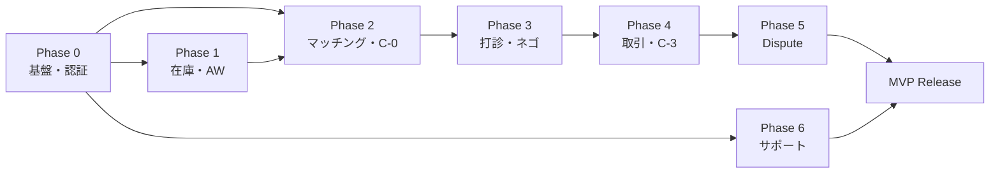

# 14. 実装フェーズ分割（Implementation Phases）

> **目的**：iHub MVP の実装ロードマップ。Phase 0〜6 で段階的にデリバリー、各 Phase で検証可能なマイルストーンを定義。
> エンジニア募集・着手の最終資料。

最終更新: 2026-05-01（iter43）
ステータス: Draft v1.0

---

## このドキュメントの位置付け

- 設計ドキュメント（02-13）の集大成
- 「**何をどの順番で作るか**」を定義
- 各 Phase で「機能 / 画面 / API / 完了基準」を明示
- 依存関係を明確化し、並行開発・優先度判断の根拠

## 更新ルール

- Phase の進捗・実績は別途プロジェクト管理ツールで（このドキュメントは設計）
- 機能追加 / 削除があれば該当 Phase を更新
- 実装着手後に発覚した依存関係は反映する

## 目次

1. [前提・全体像](#1-前提全体像)
2. [Phase 0: 基盤（Foundation）](#2-phase-0-基盤foundation)
3. [Phase 1: 在庫＋AW（Inventory & Activity Window）](#3-phase-1-在庫aw)
4. [Phase 2: マッチング＋提案準備（Matching & Propose）](#4-phase-2-マッチング提案準備)
5. [Phase 3: 打診＋ネゴ＋合意（Proposal & Negotiation）](#5-phase-3-打診ネゴ合意)
6. [Phase 4: 取引＋C-3（Deal & Complete）](#6-phase-4-取引c-3)
7. [Phase 5: Dispute（異議申し立て）](#7-phase-5-dispute異議申し立て)
8. [Phase 6: サポート・法的画面（Support & Legal）](#8-phase-6-サポート法的画面)
9. [横断的関心事（Cross-cutting）](#9-横断的関心事cross-cutting)
10. [Beta テスト戦略](#10-beta-テスト戦略)
11. [Post-MVP ロードマップ](#11-post-mvp-ロードマップ)
12. [リスク・前提](#12-リスク前提)

---

## 1. 前提・全体像

### 想定チーム構成（最小）

- **バックエンドエンジニア**: 1〜2人
- **フロントエンドエンジニア**: 1〜2人（モバイル：PWA or React Native ⚠️ 要確認）
- **PM/PdM**: 0.5人（オーナー兼任可）
- **デザイナー**: 0.5人（既存 mockup あるので軽め）
- **QA**: 0.5人（Phase 5 から専任化）

### 技術スタック（候補・⚠️ 要確認）

- **バックエンド**: Node.js (Next.js API / NestJS) or Go or Ruby on Rails
- **DB**: PostgreSQL（マスタ・JSONB・gist index）
- **キャッシュ**: Redis（セッション・rate limit）
- **ストレージ**: S3互換（画像）
- **検索**: 標準SQL（MVP）→ ElasticSearch（Post-MVP）
- **モバイル**: PWA（最速）or React Native（ネイティブ感）or Flutter
- **インフラ**: AWS / GCP / Vercel / Render（要確認）
- **CI/CD**: GitHub Actions
- **モニタリング**: Sentry / Datadog（軽量なら Logtail）
- **Push通知**: FCM（Firebase Cloud Messaging）

### 全体期間見積もり

| Phase | 内容 | 概算工数（人月） | 累計 |
|---|---|---|---|
| Phase 0 | 基盤・認証 | 1.5〜2 | 1.5〜2 |
| Phase 1 | 在庫・AW・ウィッシュ | 1.5〜2 | 3〜4 |
| Phase 2 | マッチング・C-0 | 1〜1.5 | 4〜5.5 |
| Phase 3 | 打診・ネゴ・合意 | 1.5〜2 | 5.5〜7.5 |
| Phase 4 | 取引・C-3 | 1.5〜2 | 7〜9.5 |
| Phase 5 | Dispute・通報 | 1.5〜2 | 8.5〜11.5 |
| Phase 6 | サポート・法的・残UI | 0.5〜1 | 9〜12.5 |
| **合計** | **MVP リリース** | **9〜12.5 人月** | — |

※ チーム3〜4人並行で **3〜4ヶ月** が現実的なターゲット。

### Phase 依存関係

Phase 0 完了が前提。Phase 1 と Phase 6 は並行可能（チームサイズ次第）。

---

## 2. Phase 0: 基盤（Foundation）

### ゴール

> 「ログインできて、自分のプロフィールが見られる」状態。

### 含む機能（要件 ID）

- F0-1 アカウント作成・認証（メアド + Google OAuth）
- F0-2 メール認証
- F0-3 パスワードリセット
- F0-4 オンボーディング 5段階（性別→推し→メンバー→AW→完了）
- F0-5 プロフィール基本情報
- F0-6 アカウント削除（30日猶予）

### 含む画面（11_screen_inventory.md より）

| カテゴリ | 画面ID |
|---|---|
| 認証 | `AUTH-welcome`, `AUTH-signup`, `AUTH-google-consent`, `AUTH-email-sent`, `AUTH-email-confirmed`, `AUTH-login`, `AUTH-pwd-reset`, `AUTH-delete`, `AUTH-delete-done` |
| オンボーディング | `ONB-gender`, `ONB-group`, `ONB-member`, `ONB-aw`, `ONB-done` |
| プロフィール（基本） | `PRO-hub`（読み取り専用版） |
| 設定（基本） | `SET-top` |

合計：**15画面**

### 含む API（13_api_spec.md より）

| カテゴリ | エンドポイント |
|---|---|
| Auth | `register`/`verify-email`/`resend-verification`/`login`/`oauth/google`/`forgot-password`/`reset-password`/`logout`/`refresh` |
| Accounts | `me` GET/PATCH, `me/oshi` PUT, `me/onboarding` POST, `me/delete-request` POST/DELETE |
| Masters | `genres`/`groups`/`characters`/`goods-types` 全GET |
| Notifications | `devices` POST/DELETE, `settings` GET/PATCH |

合計：**約20エンドポイント**

### 完了基準（DoD）

- [ ] 新規ユーザーがメアド経由 or Google で登録できる
- [ ] メール認証リンクをクリックすると `verified` になる
- [ ] オンボーディング5段階を完了して `active` になる
- [ ] ログイン・ログアウトができる
- [ ] パスワードリセットフロー一周通る
- [ ] アカウント削除→30日猶予→自動削除が動く（バッチ実装）
- [ ] プロフィール画面で自分の情報が見られる
- [ ] **インフラ**：本番DB・staging環境・CI/CD・ロギング・エラー監視が稼働
- [ ] **セキュリティ**：HTTPS・パスワードハッシュ・JWT 期限管理

### 概算工数

**1.5〜2 人月**（インフラ構築含む）

- バックエンド：1人月（auth + accounts + masters + 基盤構築）
- フロントエンド：0.5〜1人月（auth/onboarding 画面実装）
- インフラ：0.3人月（本番環境構築）

### 主な未確定項目（実装着手前に解決）

- 技術スタック確定（[1]）
- インフラ選定（[1]）
- JWT vs Session（[2]）
- OAuth subject の検証境界（[3]）

---

## 3. Phase 1: 在庫＋AW（Inventory & Activity Window）

### ゴール

> 「自分のグッズと活動予定を登録して、リスト化できる」状態。

### 含む機能（要件 ID）

- F1-1 在庫登録（写真撮影→切り抜き→メタ入力）
- F1-2 在庫の譲/自分用キープ分類（iter19.5）
- F1-3 在庫の数量管理（1行=1個 + UI集約、iter29）
- F1-4 在庫の携帯モード（is_carrying）
- F1-5 ウィッシュ登録・編集
- F1-6 ウィッシュの flexibility / priority
- F2-1 AW作成（イベント主導 or 位置主導）
- F2-2 AW一時停止・再開・削除
- F2-3 AW一覧表示

### 含む画面

| カテゴリ | 画面ID |
|---|---|
| 在庫 | `INV-grid`, `INV-shoot`, `INV-crop`, `INV-meta`, `INV-xpost` |
| ウィッシュ | `WSH-list`, `WSH-empty`, `WSH-edit` |
| AW | `AW-list`, `AW-edit-event`, `AW-edit-location`, `AW-other` |

合計：**12画面**

### 含む API

| カテゴリ | エンドポイント |
|---|---|
| Items | CRUD + bulk + image upload + carrying toggle = 9件 |
| Wishes | CRUD + matches = 6件 |
| AWs | CRUD + pause/resume + intersect = 8件 |
| Masters | `events` GET/POST = 2件 |

合計：**約25エンドポイント**

### 完了基準

- [ ] 在庫を写真からまとめて登録できる（B-2① 撮影 → ② 切り抜き → ③ メタ入力）
- [ ] 在庫の `kind` を for_trade ⇄ keep で切り替えできる
- [ ] 在庫×数量Nを N行INSERTで保存できる
- [ ] ウィッシュをCRUDできる、flexibility/priority が設定できる
- [ ] AW を新規作成・編集・一時停止・削除できる
- [ ] イベントタグをマスタから選択 or 新規作成できる
- [ ] 自分のAW一覧が表示できる
- [ ] X投稿テンプレ生成（B-3）が動く

### 概算工数

**1.5〜2 人月**

- バックエンド：0.7人月（CRUD系API＋画像処理）
- フロントエンド：1〜1.5人月（B-2撮影フローが複雑）

### 並行開発の余地

- Phase 0 完了後、Phase 1 と Phase 6 は並行可能（依存少）
- B-2 撮影フローは独立性高、別エンジニアが担当可

### 主な未確定項目

- イメージアップロードの方式（直接 vs 署名付きURL、[26]）
- マスタ events のユーザー作成タグの公開ポリシー（[20]）
- マスタ events の重複検出ルール（[21]）

---

## 4. Phase 2: マッチング＋提案準備（C-0）

### ゴール

> 「マッチング相手を見つけて、打診の準備（C-0）ができる」状態。
> ※ 打診送信は Phase 3。

### 含む機能（要件 ID）

- F3-1 マッチング計算（バッチ + オンデマンド）
- F3-2 4種類のマッチタブ（perfect / forward / backward / explore）
- F3-3 ホーム画面のマッチカード表示
- F3-4 検索・フィルタ・保存検索
- F3-5 推し2階層（L1/L2）対応のフィルタ（iter24, 25）
- F4-1 提示物選択 C-0（譲・受け取る・待ち合わせ の3タブ）
- F4-2 待ち合わせ：即時モード・日時指定モード（iter33）
- F4-3 待ち合わせのAW自動登録（iter33）

### 含む画面

| カテゴリ | 画面ID |
|---|---|
| ホーム | `HOM-main` |
| 検索 | `SCH-main`, `SCH-filter`, `SCH-saved` |
| C-0 提示物選択 | `C0-mine-perfect`, `C0-theirs-perfect`, `C0-forward`, `C0-backward`, `C0-meetup-scheduled`, `C0-meetup-now` |
| 他人プロフ | `PRO-other` |

合計：**11画面**

### 含む API

| カテゴリ | エンドポイント |
|---|---|
| Matches | 4タブ + feed + saved searches = 6件 |
| Users | `:id` GET, `:id/items` GET, `:id/aws` GET = 3件 |
| AWs | `intersect` GET = 1件 |
| Proposals | `POST /proposals`（draft 作成）= 1件 |

合計：**約11エンドポイント**

### 完了基準

- [ ] ホーム画面でマッチ候補が4タブで表示される
- [ ] マッチカードから他ユーザーのプロフィール → C-0 へ遷移できる
- [ ] 検索（キーワード・絞込・並び替え・距離）が動く
- [ ] 保存検索を作成・実行・削除できる
- [ ] C-0 で提示物（mine + theirs）を選択できる、数量ステッパーも動く
- [ ] C-0 で待ち合わせ（即時 or 日時指定）を設定できる
- [ ] AW自動登録チェックで既存AW or 新規AWが選べる
- [ ] C-0 完了でメッセージ作成画面（C-1）に進める（Phase 3 で完成）
- [ ] マッチング計算バッチが定期実行される

### 概算工数

**1〜1.5 人月**

- バックエンド：0.5人月（マッチング計算・検索）
- フロントエンド：0.7〜1人月（C-0 が複雑）

### 主な未確定項目

- マッチング計算頻度（毎日/6h/1h、[23]）
- proposals 作成タイミング（C-0 完了 or C-1 送信、[6]）
- リアルタイム通知のスロットル（[24]）
- meetup `now` モードの「合流場所」決定ロジック

---

## 5. Phase 3: 打診＋ネゴ＋合意

### ゴール

> 「打診を送って、ネゴしながら合意成立できる」状態。

### 含む機能

- F4-4 打診送信（メッセージ生成・送信前確認）
- F4-5 打診受信（3択：承諾／反対提案／拒否）
- F5-1 ネゴチャット（提案修正履歴・チャット）
- F5-2 7日期限・3日目/6日目リマインド・延長
- F5-3 提案修正（C-0 編集モード）
- F5-4 合意確認モーダル
- F5-5 取引成立画面（C-15-success）
- F5-6 相手の譲モーダル（ネゴ中の参照）

### 含む画面

| カテゴリ | 画面ID |
|---|---|
| C-1 | `C1-propose`, `C1-receive` |
| C-1.5 | `C15-normal`, `C15-r3`, `C15-r6`, `C15-expired`, `C15-mine-agreed`, `C15-modal-agreement`, `C15-success`, `C15-modal-partner-inv` |
| 取引タブ | `TRD-pending` |

合計：**11画面**

### 含む API

| カテゴリ | エンドポイント |
|---|---|
| Proposals | send/agree/reject/counter/revise/extend/share-inventory/revisions = 8件 |
| Messages | 取得・送信・画像アップ = 3件 |
| Deals | 合意で生成（POST 内部、外部APIなし） |

合計：**約11エンドポイント**

### 完了基準

- [ ] C-0 → C-1 で打診メッセージを書いて送信できる
- [ ] 受信者が C-1 で承諾／反対提案／拒否できる
- [ ] 反対提案で C-1.5 ネゴチャットに進める
- [ ] ネゴチャットで提案修正・メッセージ送信ができる
- [ ] 7日経過で `expired` になる
- [ ] 3日目／6日目にリマインド通知が来る
- [ ] 期限延長 +7日が動く
- [ ] 双方合意で取引成立画面 → C-2 に進める
- [ ] 合意済アイテムは `in_deal` 状態に
- [ ] 取引タブ「打診中」に sent/negotiating/agreement_one_side が表示される

### 概算工数

**1.5〜2 人月**

最も複雑なフェーズ。

- バックエンド：0.7人月（状態遷移・リマインド・期限管理）
- フロントエンド：1〜1.5人月（C-1.5 が複雑）

### 主な未確定項目

- ネゴ中の提案修正で `last_action_at` リセットするか（[7]）
- `agreement_one_side` 中の修正で `agreed_by_*` reset（[8]）
- proposal_revisions 保存粒度（[10]）
- system message event_type 値リスト（[11]）
- 双方同時合意のレースコンディション

---

## 6. Phase 4: 取引＋C-3

### ゴール

> 「合意後の当日連絡から評価完了まで通せる」状態。

### 含む機能

- F6-1 取引チャット（当日のライブ運用、iter34）
- F6-2 服装写真シェア（合流支援）
- F6-3 現在地共有（mini map付きメッセージ）
- F6-4 到着ステータス（手動報告、MVP）
- F6-5 QR本人確認
- F6-6 証跡撮影（左=相手 / 右=自分 固定、iter4）
- F6-7 両者承認
- F6-8 評価（1-5星 + コメント、コレクション連携、X投稿）
- F6-9 取引キャンセル・遅刻通知
- F7-1 コレクション図鑑（wish連携）

### 含む画面

| カテゴリ | 画面ID |
|---|---|
| C-2 | `C2-chat` |
| C-3 | `C3-capture`, `C3-approve`, `C3-rate` |
| 取引タブ | `TRD-active`, `TRD-past`, `TRD-empty` |
| 図鑑 | `POK-list`, `POK-owned`, `POK-missing`, `POK-comp` |

合計：**11画面**

### 含む API

| カテゴリ | エンドポイント |
|---|---|
| Deals | CRUD + arrivals + outfit-photos + evidence + approve + dispute + rate + cancel = 10件 |
| Messages | location_share / outfit_photo / image アップ（Phase 3 で実装済の拡張） |
| Users | `:id/qr` GET = 1件 |

合計：**約11エンドポイント**

### 完了基準

- [ ] C-2 取引チャットで取引内容＋待ち合わせがピン留め表示される
- [ ] 服装写真をシェアできる（CTA・クイックアクション両方から）
- [ ] 現在地を共有できる（mini map付きメッセージ）
- [ ] 「会場到着」ボタンで手動到着報告ができる
- [ ] QR本人確認モーダルが動く
- [ ] C-3① 証跡撮影 → ② 両者承認 → ③ 評価 まで一周できる
- [ ] 双方rated で `deals.status='rated'`、`completed_at` セット
- [ ] 関連 `user_haves.status='traded'` に更新される
- [ ] 関連 wish が `achieved` になる
- [ ] コレクション図鑑が更新される
- [ ] 過去取引が表示される
- [ ] 取引キャンセル・遅刻通知が動く

### 概算工数

**1.5〜2 人月**

- バックエンド：0.7人月（状態遷移多い、画像アップ複数）
- フロントエンド：1〜1.5人月（C-2 / C-3 / 図鑑）

### 主な未確定項目

- 細分化評価（punctuality 等）MVP採用可否（[14]）
- 「会場到着」ボタンの配置・タイミング（C-2 spec §未確定#1）
- 30分遅刻時のキャンセル権発動方法（[18]）
- 服装写真の顔ブラー処理（[13]）
- オフライン時の同期（C-2 spec §未確定#5）

---

## 7. Phase 5: Dispute（異議申し立て）

### ゴール

> 「異常時の申告→反論→仲裁が動く」状態。

### 含む機能

- F8-1 dispute申告（5カテゴリ・証跡添付）
- F8-2 反論機会（24h）
- F8-3 仲裁（運営判定、4h/24h SLA）
- F8-4 結果通知（5値decision + 4段階penalty）
- F8-5 再審査申立て（1回限り、7日以内）
- F8-6 申告中の凍結（両者新規打診不可）
- F8-7 通報（プロフ・取引・メッセージから）

### 含む画面

| カテゴリ | 画面ID |
|---|---|
| Dispute | `D-1`, `D-2-required`, `D-2-skippable`, `D-3`, `D-4`, `D-5a`, `D-5b`, `D-5c`, `D-5d`, `D-6a`, `D-6b`, `D-6c`, `D-6d` |
| キャンセル・遅刻 | `D-cancel`, `D-late` |
| 通報 | `RPT-form`, `RPT-complete` |

合計：**17画面**

### 含む API

| カテゴリ | エンドポイント |
|---|---|
| Disputes | CRUD + reply + withdraw + admin-question + resolve + reappeal = 7件 |
| Reports | POST + GET = 2件 |

合計：**9エンドポイント**

### 運営UI（最低限）

- dispute一覧（申告日時・状態・SLA期限・カテゴリでフィルタ）
- dispute詳細（証跡画像・反論内容・追加質問送信・仲裁決定UI）
- 通報一覧（同様）
- ペナルティ管理（accounts.account_status 操作）

### 完了基準

- [ ] D-1 カテゴリ選択 → D-2 証跡 → D-3 送信完了 が一周
- [ ] 相手側に D-4 反論機会通知が届く（24h SLA）
- [ ] 反論あり/なし/24h無回答 で D-5a/b/c に分岐
- [ ] 運営から追加質問（D-5d）が送れる
- [ ] 仲裁決定（5値 decision + 4段階 penalty）→ D-6a/b 結果通知が出る
- [ ] D-6c 再審査申立て（1取引1回・7日以内）が動く
- [ ] 申告中は両者の新規打診が凍結される
- [ ] 通報フォーム → 受付完了 が一周
- [ ] 取引キャンセル・遅刻通知が動く

### 概算工数

**1.5〜2 人月**

- バックエンド：0.7〜1人月（状態管理・SLA管理・運営連携）
- フロントエンド：0.5〜0.7人月（D-1〜D-6d 17画面）
- 運営UI：0.3〜0.5人月（管理画面）

### 主な未確定項目

- 反論機会期限が 24h or 4h はカテゴリで変わるか（[15]）
- 仲裁SLA超過時のエスカレーション（[15]）
- `disputed` 解決時に `rated` に戻るか別終了状態か（[16]）
- 再審査のデータ構造（disputes に status 追加 vs 別テーブル、[17]）
- 通報後の自動処理ロジック（即ブロック？運営確認後？、[30]）

---

## 8. Phase 6: サポート・法的画面

### ゴール

> 「リリース可能な状態」。残UIすべて実装。

### 含む機能

- F9-1 法的画面（利用規約・プライバシーポリシー・特商法）
- F9-2 ヘルプ・FAQ
- F9-3 問い合わせフォーム
- F9-4 通知設定
- F9-5 プロフ補助（ブロックリスト・在庫公開設定・本人確認・アプリ情報）
- F9-6 設定画面の充実

### 含む画面

| カテゴリ | 画面ID |
|---|---|
| 法的 | `LEG-terms`, `LEG-privacy`, `LEG-notice` |
| ヘルプ | `HLP-faq`, `HLP-contact` |
| 設定 | `SET-aw`, `SET-notif`, `SET-app-info` |
| プロフ補助 | `PRO-edit`, `PRO-oshi-edit`, `PRO-identity`, `PRO-block-list`, `PRO-inv-privacy` |
| 参考 | `BDG-samples`（実装対象外、デザイン選定用） |

合計：**13画面**

### 含む API

| カテゴリ | エンドポイント |
|---|---|
| Notifications | settings/devices = 4件（Phase 0 で大半実装済） |
| Reports | （Phase 5で実装済） |
| Accounts | blocks/oauth + 各種更新（Phase 0で大半実装済） |

合計：**実装は少なめ**（Phase 0 と重複多）

### 完了基準

- [ ] 全画面が表示できる
- [ ] 利用規約・プライバシーポリシー・特商法が読める
- [ ] FAQ が表示できる、問い合わせフォーム送信できる
- [ ] 通知設定（トピック別ON/OFF・夜間ミュート）が動く
- [ ] ブロックリストでブロック・解除ができる
- [ ] アプリ情報（バージョン・OS・コピーライト）が表示できる
- [ ] 推し設定編集できる

### 概算工数

**0.5〜1 人月**

- フロントエンド：0.5人月（静的多め、UI実装中心）
- バックエンド：0.2人月（設定系API追加）

### 並行開発

- Phase 0完了後ならいつでも並行可能（他Phase非依存）
- 法的画面は別途、法務監修必須（運営側で内容詰める）

---

## 9. 横断的関心事（Cross-cutting）

各Phaseで継続的に取り組む項目。

### 9-1. ロギング・モニタリング

- 構造化ログ（リクエスト ID 付与、ユーザー ID 付与）
- エラー監視（Sentry等）
- パフォーマンス監視（API応答時間、DB クエリ時間）
- ビジネスメトリクス（DAU、登録数、打診成立率、disputes率）

### 9-2. プッシュ通知

- Phase 0 でデバイス登録基盤
- 各Phaseで該当通知トピックを実装
- トピック例：
  - `match_found`：完全マッチ発見時
  - `proposal_received`：打診受信
  - `nego_message`：ネゴチャットメッセージ
  - `nego_reminder_3day` / `nego_reminder_6day`
  - `agreement_reached`：取引成立
  - `arrival_recorded`：相手到着
  - `dispute_filed`：申告受信
  - `arbitration_resolved`：仲裁決定

### 9-3. 国際化（i18n）

- MVP は日本語のみ
- Post-MVP で韓国語・中国語・英語対応検討
- 文字列の外出し（i18n フレームワーク導入）はPhase 0 から推奨

### 9-4. パフォーマンス

- マッチング計算のスケーラビリティ（ユーザー数増加時）
- 画像処理の非同期化（アップロード後にバックグラウンドリサイズ）
- DBインデックス設計（特に `proposals.status`, `availability_windows.start_at`）
- N+1 クエリ防止（Items に images JOIN 等）

### 9-5. セキュリティ

- HTTPS 必須
- パスワードハッシュ（bcrypt or argon2）
- JWT 期限管理（24h程度、refresh token）
- CSRF 対策（Cookie認証時）
- XSS 対策（HTML エスケープ、CSP）
- SQL インジェクション対策（プリペアドステートメント）
- レート制限（Redis 等）
- 通報・dispute から発展した場合のアカウント凍結
- 個人情報暗号化（保存時、要件次第）

### 9-6. アクセシビリティ

- スクリーンリーダー対応（aria-label）
- キーボード操作対応
- 色のコントラスト比（WCAG AA）
- フォントサイズ調整対応

### 9-7. テスト戦略

- ユニットテスト（バックエンドAPI、共通ロジック）
- 統合テスト（DBアクセス含む）
- E2E テスト（主要フロー：登録→打診→合意→取引→評価）
- ビジュアルリグレッションテスト（モバイルUI、Phase 4以降）
- 負荷テスト（マッチング計算、Phase 6 後）

---

## 10. Beta テスト戦略

### 10-1. 内部テスト（α）

- Phase 4 完了時点で開始
- 開発チーム + 関係者数名
- 主要フロー（登録→打診→合意→取引→評価）の素通り検証
- 期間：2週間

### 10-2. クローズドβ

- Phase 5 完了時点で開始
- 招待制、20〜50人
- ペルソナ「ハナ」近い層から優先
- フィードバック収集（in-app + Form）
- 期間：4週間

### 10-3. オープンβ

- Phase 6 完了時点で開始
- ジャンル限定（KPOP のみで開始、戦略通り）
- スター級5〜10グループから着手
- 期間：4〜6週間

### 10-4. 本リリース

- オープンβから安定確認後
- マーケティング開始

---

## 11. Post-MVP ロードマップ

MVP 後の改善優先度（順不同・要見直し）：

| カテゴリ | 内容 | 優先度 |
|---|---|---|
| ジャンル拡大 | 邦アイ・2.5次元・アニメ・VTuber | ⭐⭐⭐ |
| 到着検知 | GPS自動 / QRスキャン連動 | ⭐⭐ |
| リアルタイム | WebSocket（メッセージ・状態同期） | ⭐⭐ |
| 認証拡張 | passkey / Apple Sign-In | ⭐⭐ |
| 検索強化 | ElasticSearch / 類似アイテム検索 | ⭐⭐ |
| 服装写真 | 顔ブラー自動化 / アバター生成 | ⭐ |
| 細分化評価 | 時間厳守度・実物状態・コミュニケーション | ⭐ |
| パフォーマンス | キャッシュ層・CDN・画像最適化 | ⭐⭐⭐ |
| 国際化 | 韓国語 → 中国語 → 英語 | ⭐⭐ |
| 郵送モード | 制限付き対応 | ⭐ |
| グループ取引 | 3者以上の同時取引（L4 多者間） | ⭐ |
| アプリ化 | PWA → ネイティブアプリ（必要に応じて） | ⭐⭐ |
| 自動翻訳 | DM の自動翻訳（外国人ユーザー対応） | ⭐ |

---

## 12. リスク・前提

### 12-1. 技術リスク

| リスク | 影響 | 対策 |
|---|---|---|
| 技術スタック未確定 | Phase 0 開始遅延 | 早期に PoC で決定 |
| マッチング計算のスケーラビリティ | DAU 1万超で性能劣化 | Phase 2 完了後に負荷テスト |
| 画像ストレージのコスト | 急成長時のコスト爆発 | S3 + CDN、ライフサイクルポリシー |
| WebSocket 不採用時のレイテンシ | チャットの応答遅延 | polling 間隔チューニング、Post-MVP で WS 化 |

### 12-2. ビジネスリスク

| リスク | 影響 | 対策 |
|---|---|---|
| 同担拒否文化との摩擦 | 利用率低下 | プロフでブロック容易化、通報機能充実 |
| 詐欺・dispute の運用負荷 | 運営工数爆発 | dispute SLAを段階的に厳格化、AI支援を検討 |
| トラブル時の警察対応 | レピュテーション低下 | 利用規約・特商法の整備、本人確認段階導入 |
| ジャンル拡大時のマスタ管理 | スケーラビリティ | コミュニティ協力の仕組み、運営体制強化 |

### 12-3. 法的・運用リスク

| リスク | 対策 |
|---|---|
| 個人情報保護法対応 | プライバシーポリシー法務監修、暗号化 |
| 特定商取引法対応 | 表記整備（既に LEG-notice 実装） |
| 未成年利用 | 規約で年齢制限、保護者同意（Post-MVP） |
| 海外ユーザー対応 | GDPR 等の地域別対応（Post-MVP） |

### 12-4. プロジェクト前提

- オーナー（プロダクトオーナー）が継続的に関与可能
- エンジニア募集 / 採用が時間内に完了
- インフラ予算（月額）：MVP リリース時で月 5〜10万円想定
- 法務・税務サポート：外注 or 顧問契約

---

## 関連 docs

- [`notes/00_persona.md`](00_persona.md) — 想定ユーザー
- [`notes/02_system_requirements.md`](02_system_requirements.md) — 機能要件詳細
- [`notes/03_strategy.md`](03_strategy.md) — 戦略
- [`notes/05_data_model.md`](05_data_model.md) — DB設計
- [`notes/07_mvp_handoff.md`](07_mvp_handoff.md) — MVP 引き継ぎ
- [`notes/09_state_machines.md`](09_state_machines.md) — 状態遷移
- [`notes/11_screen_inventory.md`](11_screen_inventory.md) — 画面マトリクス
- [`notes/13_api_spec.md`](13_api_spec.md) — API仕様

---

## 更新ログ

- v1.0 (2026-05-01, iter43): 初版。Phase 0〜6 の構成、依存関係、工数見積もり、横断的関心事、Beta 戦略、Post-MVP、リスクを整理。
